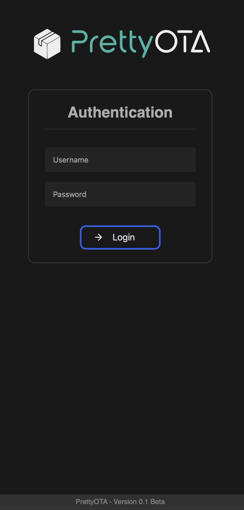
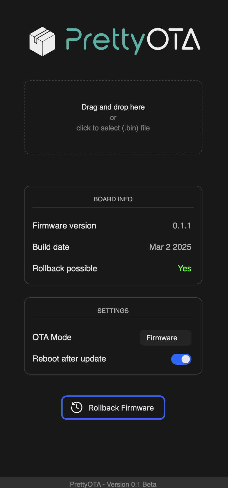

<p align="center"><svg xmlns="http://www.w3.org/2000/svg" width="460" height="100" viewBox="0 0 2719 563" version="1.1"><path d="M 633.990 77.283 C 621.482 83.886, 619.487 99.883, 629.988 109.370 C 636.219 115, 636.052 114.987, 705.500 115.009 C 775.540 115.031, 776.141 115.075, 788.412 120.984 C 831.592 141.779, 831.868 205.144, 788.871 226.300 C 775.410 232.923, 774.897 232.963, 703.218 232.983 C 612.781 233.007, 623.052 221.659, 623.022 321.593 L 623 394.685 625.327 399.093 C 631.887 411.519, 647.914 413.479, 657.370 403.012 C 662.973 396.810, 662.988 396.617, 662.994 332.250 L 663 273 713.250 272.992 C 783.638 272.980, 794.498 271.199, 817.122 255.950 C 882.340 211.992, 872.802 113.058, 800.416 82.669 C 782.964 75.342, 786.135 75.598, 708.490 75.238 L 638.480 74.913 633.990 77.283 M 1357.960 78.303 C 1354.965 79.886, 1352.877 81.983, 1351.272 85.018 L 1348.939 89.430 1349.260 209.465 C 1349.618 343.371, 1349.030 331.762, 1356.453 351.500 C 1375.753 402.822, 1449.236 436.334, 1449.438 393.907 C 1449.494 382.060, 1445.938 377.648, 1433 373.513 C 1413.656 367.331, 1398.611 352.082, 1391.655 331.607 C 1389.654 325.714, 1389.569 323.191, 1389.250 259.750 L 1388.919 194 1412.394 194 C 1426.596 194, 1436.982 193.579, 1438.685 192.933 C 1451.429 188.105, 1452.944 169.986, 1441.273 161.983 C 1437.696 159.530, 1437.359 159.496, 1413.326 159.200 L 1389 158.901 1388.978 124.700 C 1388.954 87.422, 1388.712 85.661, 1382.882 80.317 C 1377.403 75.295, 1365.471 74.331, 1357.960 78.303 M 1506.830 78.027 C 1504.812 79.093, 1502.112 81.436, 1500.830 83.233 L 1498.500 86.500 1498.196 204 C 1497.842 340.624, 1497.615 337.343, 1509.009 360 C 1533.058 407.819, 1598 432.677, 1598 394.064 C 1598 382.757, 1594.074 377.607, 1582.437 373.649 C 1559.869 365.973, 1545.730 350.997, 1539.339 328 C 1537.685 322.049, 1537.531 316.136, 1537.516 258 L 1537.500 194.500 1562 194 C 1592.538 193.377, 1597.930 190.877, 1597.984 177.315 C 1598.043 162.138, 1591.682 159.052, 1560.286 159.022 L 1537.071 159 1536.786 122.572 C 1536.464 81.509, 1536.753 83.040, 1528.406 78.266 C 1523.204 75.292, 1512.238 75.170, 1506.830 78.027 M 1150.749 153.556 C 1004.773 176.279, 1010.362 397.001, 1157.346 414.089 C 1216.121 420.922, 1292.915 371.029, 1267.746 342.363 C 1258.270 331.571, 1247.205 332.931, 1234.098 346.499 C 1183.927 398.436, 1100.034 374.725, 1084.551 304.232 L 1083.841 301 1184.105 301 C 1305.629 301, 1298.006 302.445, 1297.996 279.412 C 1297.961 202.819, 1226.525 141.760, 1150.749 153.556 M 990.565 156.597 C 942.695 169.725, 907.572 208.877, 897.353 260.500 C 895.261 271.071, 894.101 384.351, 895.991 393.459 C 899.955 412.553, 925.051 415.961, 933.110 398.500 C 934.834 394.765, 934.958 390.796, 934.986 338.500 C 935.025 267.345, 935.559 262.258, 945.076 242.362 C 957.222 216.973, 976.181 201.632, 1005 193.875 C 1017.294 190.566, 1022.929 184.279, 1022.978 173.815 C 1023.054 157.644, 1010.692 151.077, 990.565 156.597 M 1642.505 157.679 C 1638.082 158.925, 1632.136 164.089, 1629.968 168.566 C 1625.890 176.990, 1625.003 174.612, 1673.947 286.475 L 1719.002 389.449 1702.787 427.475 C 1681.150 478.218, 1681.831 492.127, 1705.946 491.978 C 1718.087 491.903, 1720.248 488.740, 1739.857 442.345 C 1749.192 420.260, 1757.496 401.135, 1758.310 399.845 C 1759.125 398.555, 1760.115 396.375, 1760.510 395 C 1760.905 393.625, 1781.263 345.250, 1805.750 287.500 C 1831.621 226.487, 1850.479 180.728, 1850.764 178.271 C 1852.803 160.725, 1828.006 149.968, 1816.297 163.318 C 1814.486 165.383, 1800.653 196.923, 1777.065 252.767 C 1742.960 333.512, 1740.555 338.850, 1739.442 336.264 C 1723.616 299.480, 1666.168 169.349, 1664.426 166.337 C 1660.439 159.445, 1650.366 155.466, 1642.505 157.679 M 1153.516 193.659 C 1120.067 200.826, 1084 237.867, 1084 265.052 C 1084 265.642, 1116.630 266, 1170.475 266 L 1256.950 266 1256.330 262.750 C 1247.573 216.821, 1198.700 183.979, 1153.516 193.659" stroke="none" fill="#2cb4a4" fill-rule="evenodd"/><path d="M 233 59.853 C 225.575 64.162, 209.375 73.518, 197 80.643 C 184.625 87.769, 166.028 98.527, 155.674 104.550 C 145.319 110.572, 135.194 116.425, 133.174 117.556 C 131.153 118.688, 118.925 125.727, 106 133.200 C 93.075 140.673, 75.975 150.558, 68 155.165 C 50.946 165.018, 50.351 165.960, 58.215 170.656 C 65.892 175.241, 106.452 198.657, 113.559 202.606 L 119.617 205.973 140.059 193.728 C 157.145 183.493, 172.694 174.329, 181.170 169.500 C 184.236 167.753, 214.164 150.430, 223 145.288 C 227.675 142.568, 233.750 139.088, 236.500 137.555 C 250.303 129.862, 314.284 93.011, 314.944 92.373 C 316.187 91.174, 253.337 53.554, 248.142 52.388 C 247.239 52.185, 240.425 55.545, 233 59.853 M 2030.418 71.577 C 1894.745 90.038, 1837.882 263.010, 1934.370 363.747 C 2021.610 454.827, 2171.765 419.184, 2212.393 297.751 C 2252.614 177.536, 2153.849 54.783, 2030.418 71.577 M 2229.907 77.327 C 2218.281 83.465, 2215.653 97.840, 2224.347 107.743 C 2231.116 115.452, 2223.420 114.953, 2336.093 114.978 L 2436.685 115 2441.093 112.673 C 2455.567 105.032, 2455.464 84.379, 2440.914 76.956 C 2437.183 75.053, 2434.349 75, 2335.697 75 L 2234.315 75 2229.907 77.327 M 2559.466 76.400 C 2555.550 78.106, 2550.714 82.966, 2548.738 87.180 C 2543.229 98.933, 2427.477 382.372, 2426.705 386 C 2424.876 394.594, 2429.591 403.710, 2438.115 408.059 C 2444.337 411.233, 2593.164 411.067, 2599.750 407.879 C 2610.763 402.548, 2613.796 387.275, 2605.775 377.543 C 2599.386 369.792, 2601.741 370.047, 2536.143 370.022 C 2484.097 370.002, 2477.850 369.834, 2478.375 368.465 C 2479.841 364.644, 2572.236 139.474, 2572.422 139.267 C 2572.538 139.139, 2595.736 195.164, 2623.974 263.767 C 2688.125 419.624, 2681.149 404.256, 2689.500 408.110 C 2703.652 414.642, 2720.502 403.080, 2718.683 388.085 C 2717.953 382.062, 2597.755 87.744, 2594.089 83 C 2588.369 75.598, 2569.543 72.010, 2559.466 76.400 M 314.500 105.159 C 301.775 112.656, 299.419 114.019, 252.500 141.045 C 236 150.550, 211.025 164.957, 197 173.061 C 182.975 181.165, 161.600 193.515, 149.500 200.505 C 122.799 215.930, 126.033 208.884, 126.015 251.677 L 126 287.853 131.750 291.090 C 134.912 292.871, 140.798 296.305, 144.829 298.722 C 156.328 305.617, 155.478 308.113, 155.638 266.986 L 155.775 231.500 165.638 225.648 C 171.062 222.430, 177.408 218.728, 179.741 217.423 C 183.174 215.502, 193.534 209.554, 209.219 200.500 C 210.172 199.950, 216.925 196.058, 224.226 191.851 C 231.526 187.644, 248.975 177.575, 263 169.477 C 277.025 161.378, 290.390 153.681, 292.701 152.371 C 295.011 151.062, 306.711 144.289, 318.701 137.321 C 330.690 130.353, 344.034 122.652, 348.354 120.208 C 357.844 114.838, 358.169 115.446, 340.271 105.081 C 325.679 96.631, 328.992 96.621, 314.500 105.159 M 2038.500 111.064 C 1932.952 125.413, 1888.679 257.411, 1963.210 335.538 C 2042.951 419.127, 2180.410 360.246, 2180.410 242.500 C 2180.410 163.328, 2113.040 100.931, 2038.500 111.064 M 345 134.718 C 333.175 141.591, 311.350 154.210, 296.500 162.759 C 255.082 186.604, 227.172 202.698, 208.500 213.506 C 199.150 218.918, 188.485 225.021, 184.799 227.070 C 169.504 235.570, 169.544 235.205, 183.093 242.872 C 187.717 245.489, 200.725 252.963, 212 259.481 C 252.507 282.899, 245.423 281.281, 262.926 271.118 C 270.392 266.784, 278.300 262.232, 280.500 261.004 C 288.368 256.613, 293.732 253.516, 310 243.969 C 323.349 236.135, 364.152 212.573, 384.642 200.867 C 442.580 167.764, 444.200 166.687, 440.853 163.482 C 440.109 162.769, 431.850 157.808, 422.500 152.457 C 378.508 127.281, 372.437 123.760, 371.550 122.910 C 369.526 120.971, 365.791 122.632, 345 134.718 M 2328.637 155.465 C 2326.513 156.222, 2323.483 158.079, 2321.905 159.591 C 2315.634 165.599, 2315.922 159.294, 2316.224 284 L 2316.500 397.500 2318.820 400.752 C 2327.998 413.620, 2346.468 412.741, 2353.673 399.093 L 2356 394.685 2355.978 282.593 C 2355.953 156.930, 2356.499 166.158, 2348.684 159.296 C 2342.904 154.221, 2335.888 152.880, 2328.637 155.465 M 47.461 174.250 C 47.199 174.938, 47.101 225.874, 47.243 287.442 L 47.500 399.385 65.500 409.768 C 75.400 415.479, 85.975 421.528, 89 423.209 C 92.025 424.889, 94.950 426.616, 95.500 427.045 C 96.050 427.474, 105.725 433.095, 117 439.536 C 128.275 445.977, 138.850 452.029, 140.500 452.984 C 159.037 463.718, 192.072 482.789, 202 488.488 C 208.875 492.433, 218.775 498.148, 224 501.187 C 238.925 509.868, 241.335 510.952, 243.284 509.861 C 245.532 508.603, 245.989 287.619, 243.750 284.819 C 243.063 283.959, 233.050 277.868, 221.500 271.283 C 193.206 255.153, 181.604 248.463, 174.715 244.304 C 165.503 238.744, 165.952 236.757, 166.023 282.762 C 166.057 304.480, 165.915 322.419, 165.707 322.626 C 165.196 323.137, 115.694 294.887, 114.765 293.555 C 114.361 292.975, 114.024 273.768, 114.015 250.874 L 114 209.249 105.250 204.223 C 100.438 201.459, 94.925 198.310, 93 197.225 C 91.075 196.141, 82.835 191.370, 74.690 186.625 C 49.140 171.741, 48.524 171.460, 47.461 174.250 M 431.500 180.172 C 424.900 184.060, 417.475 188.376, 415 189.764 C 410.389 192.348, 401.122 197.688, 378.821 210.608 C 371.847 214.649, 364.647 218.810, 362.821 219.855 C 360.994 220.901, 352.300 225.916, 343.500 231 C 334.700 236.084, 326.150 241.020, 324.500 241.968 C 306.662 252.223, 301.348 255.337, 300.477 256.041 C 299.915 256.496, 296.990 258.192, 293.977 259.809 C 280.434 267.083, 251.542 284.122, 250.837 285.251 C 249.015 288.168, 249.851 508.817, 251.688 509.845 C 253.900 511.083, 255.266 510.501, 269 502.471 C 275.325 498.773, 286.125 492.508, 293 488.549 C 299.875 484.590, 317.425 474.457, 332 466.031 C 346.575 457.605, 364.125 447.477, 371 443.525 C 377.875 439.572, 388 433.718, 393.500 430.517 C 407.511 422.360, 435.620 406.212, 441 403.228 C 443.475 401.855, 446.064 400.286, 446.754 399.740 C 449.247 397.768, 448.005 173.550, 445.500 173.302 C 444.400 173.193, 438.100 176.284, 431.500 180.172" stroke="none" fill="#ededed" fill-rule="evenodd"/></svg></p>


### <center>A modern looking OTA update server with easy rollback</center>

## Features
- ***Drag and drop*** firmware or filesystem .bin file to start updating
- ***Rollback*** to previous firmware with one button click
- ***Show info*** about board (Firmware version, build time)
- Automatic ***reboot*** after update/rollback
- If needed enable **authentication** (username and password login)

## Usage
Just one line of code:
```cpp
#include <WiFi.h>
#include "PrettyOTA.hpp"

const char* WIFI_SSID     = "YOUR_SSID";
const char* WIFI_PASSWORD = "YOUR_WIFI_PASSWORD";

AsyncWebServer  server(80);
PrettyOTA       OTA;

void setup() {
    // Initialize WiFi
    WiFi.begin(WIFI_SSID, WIFI_PASSWORD);
    
    // Initialize OTA
    OTA.Begin(&server);
    
    // Start web server
    server.begin();
}

void loop() {
}
```

## How it looks
<p align="center" style="display:inline;">


</p>

## The Begin function
```cpp
PrettyOTA::Begin(Server, Username, Password, IsPasswordMD5Hash);
```
- Server: `AsyncWebServer*`
- Username: `const char*` *(Optional)*
- Password: `const char*` *(Optional)* - Can be normal text or an MD5 hash of the password
- IsPasswordMD5Hash: `bool` *(Optional) Default: false* - Set to `true` if the password is a MD5 hash

## Callbacks
You can define your own callbacks which get called by PrettyOTA:

```cpp
#include <WiFi.h>
#include "PrettyOTA.hpp"

const char* WIFI_SSID     = "YOUR_SSID";
const char* WIFI_PASSWORD = "YOUR_WIFI_PASSWORD";

AsyncWebServer  server(80);
PrettyOTA       OTA;

void OnOTAStart()
{
    Serial.println("OTA update started");
}

void OnOTAProgress(uint32_t currentSize, uint32_t totalSize)
{
    Serial.printf("OTA Progress Current: %u bytes, Total: %u bytes\n", currentSize, totalSize);
}

void OnOTAEnd(bool successful)
{
    if (successful)
        Serial.println("OTA update finished successfully");
    else
        Serial.println("OTA update failed");
}

void setup() {
    Serial.begin(9600);
    
    // Initialize WiFi here
    WiFi.begin(WIFI_SSID, WIFI_PASSWORD);
    
    // Initialize OTA
    OTAUpdates.Begin(&server, "admin", "123");
    
    // Set callbacks
    OTAUpdates.OnStart(OnOTAStart);
    OTAUpdates.OnProgress(OnOTAProgress);
    OTAUpdates.OnEnd(OnOTAEnd);
    
    // Start web server
    server.begin();
}
```


